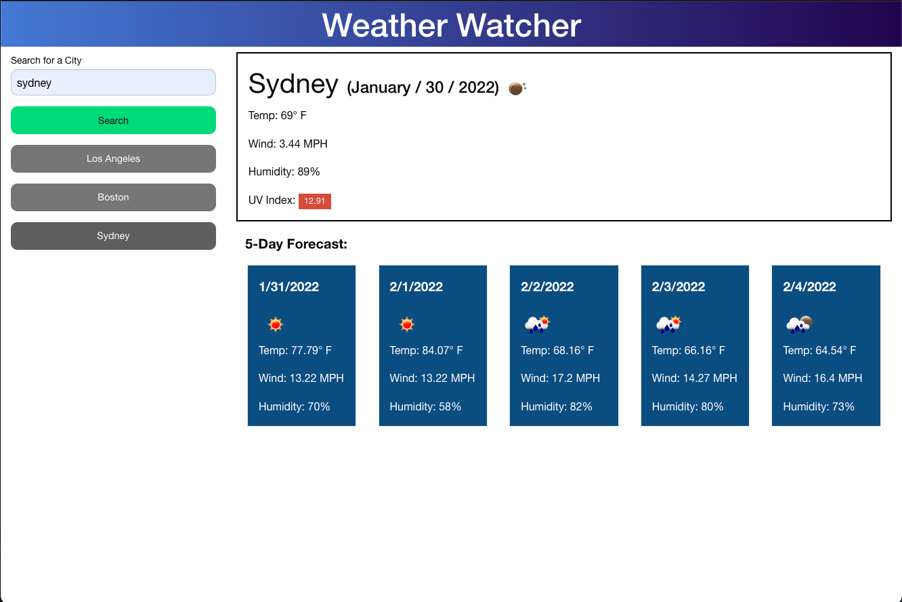

# weather-watcher

## How it works
* pick a city and see it's weather details and it's 5 day forecast
* weather details include temperature, wind, humidity, and UV index. 
* UV index is colored depending on the severity
* save multiple cities to switch back and forth. Great for the adventurous traveler
* This app uses the Open Weather API to gather data.

## Link
https://abarragan89.github.io/weather-watcher/